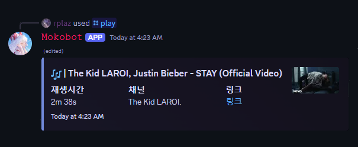
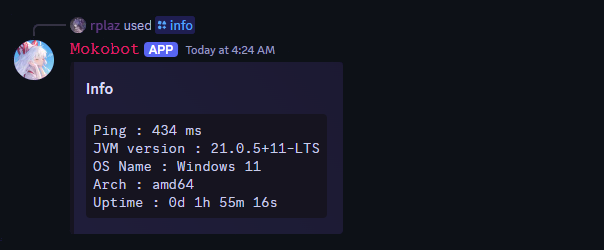
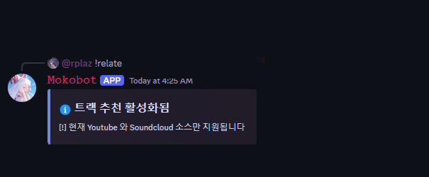

<h1 align="center">MokoBot</h1>

<p align="center">
`` 
  Mokobot은 현재 개발 중인 프로젝트로, 버그가 발생할 수 있습니다 
``
</p>

<br>

<p align="center">
🎵 **MokoBot은 강력한 음악 기능을 제공하는 Discord 봇입니다.**  
서버 관리, 게임, 출석 체크, 운세 기능 등 다양한 편의 기능이 추가될 예정이며,  
AI LLM 모델을 활용한 기능도 계획 중입니다.
</p>

<p align="center">
    <a href="https://kotlinlang.org/"></a>
    <a href="https://github.com/shaper12340w/mokobot"></a>
    <a href="./LICENSE"></a>
</p>

## ✨ 기능
- 🎵 **음악 재생** (Lavaplayer, yt-dlp, librespot 지원)
- ⚙️ **서버 관리 기능** (추후 업데이트 예정)
- 🎮 **게임, 출석 체크, 운세 기능** (추후 업데이트 예정)
- 🧠 **AI 기반 기능** (추후 업데이트 예정)

## 📸 스크린샷 (WIP)
<p align="center">
    
    
    
</p>

## 📦 사용된 기술
- **언어**: Kotlin
- **음악 라이브러리**: Lavaplayer, yt-dlp, librespot(will be used)
- **기타**: Discord API, AI LLM 모델 (추후 추가 예정)

## 📜 라이선스
```
Designed and developed by 2023 shaper12340w

This program is free software: you can redistribute it and/or modify
it under the terms of the GNU General Public License as published by
the Free Software Foundation, either version 3 of the License, or
any later version.

This program is distributed in the hope that it will be useful,
but WITHOUT ANY WARRANTY; without even the implied warranty of
MERCHANTABILITY or FITNESS FOR A PARTICULAR PURPOSE.  See the
GNU General Public License for more details.

You should have received a copy of the GNU General Public License
along with this program.  If not, see <http://www.gnu.org/licenses/>.
```